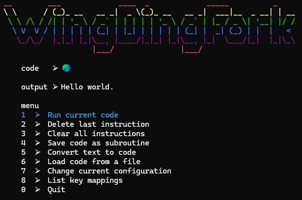

# WingDingFork
A [BrainF*ck](https://en.wikipedia.org/wiki/Brainfuck) interpreter, but the instructions are [WingDings](https://en.wikipedia.org/wiki/Wingdings)


* Generates runnable unicode BrainF*ck code from files and user input.
* Includes interpreter with programmable instructions.
* Generates and saves nested BrainF*ck code as subroutines.
* Swap configurable key mappings for default instructions and subroutines.
* Share subroutines for a given configuration while preserving your personal key mappings.
* Configurable menu hotkeys.

#### Requirements:
* [Microsoft .net framework 9.0](https://dotnet.microsoft.com/en-us/download/dotnet/9.0)
#### Running:
```
.\app\dingfork.exe
```
#### Configuration:
* [config](./dingfork/data/config.yml): configuration setttings
```
  dataConfigName : name of the keymap and subroutine directory in data
```
* [subroutines/](./dingfork/data/default/subroutines) are lists of instructions saved in the configured data folder.
   * Subroutine names begin each line of the file, following with delimited instructions corresponding to that subroutine.
   * Subroutines require a corresponding mapping in the keymap file.
* [keymap](./dingfork/data/default/keymap): maps keyboard keys to WingDing symbols and instructions.
   * Line syntax: [`wingding`|`key^instruction`].
   * Includes `subroutine` key mappings using the subroutine name as the instruction.
   * Additional instruction for resetting memory [`cls_tape`].
* [menus](./dingfork/data/menus/)
   * Line syntax: [`option_method_name`|`option_method_description`|`option_hotkey`].
   * Data for menu option mappings.
   * You can update the `option_hotkey` values to your preferences.

#### Base Instruction Set:
```
   inc_data : Increment the data pointer by one (to point to the next cell to the right).
   dec_data : Decrement the data pointer by one (to point to the next cell to the left).
   inc_byte : Increment the byte at the data pointer by one.
   dec_byte : Decrement the byte at the data pointer by one.
   out_byte : Output the byte at the data pointer.
   inp_byte : Accept one byte of input, storing its value in the byte at the data pointer.
   loop_bgn : If the byte at the data pointer is zero, then instead of moving the instruction pointer forward to the next command, jump it forward to the command after the matching ] command.
   loop_end : If the byte at the data pointer is nonzero, then instead of moving the instruction pointer forward to the next command, jump it back to the command after the matching [ command.[a]
   cls_tape : Resets memory (tape) to zeroed state.
```
