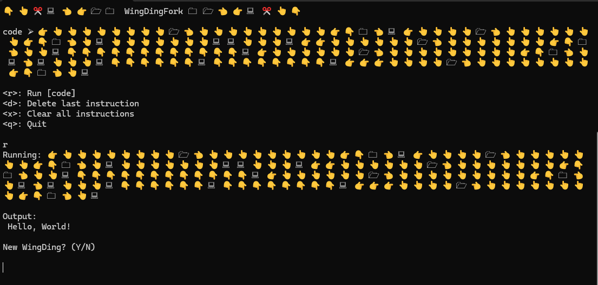

# WingDingFork
A BrainFuck interpreter but it's WingDings

### Running:
```
.\app\dingfork.exe
```

### Usage:
```
Enter or paste your [code]

Instructions:
] : 🗀 
[ : 🗁 
< : 👈︎
> : 👉︎
. : 🖳 
, : ✂ 
+ : 👆︎
- : 👇︎
 
```

### Example Program:



### Next:
        * Clean up TODOs
        
        * Update to use the WingDings as the actual instructions in code
            - Create mapping file instead of hard-coding instruction dict

                [keymap.csv]
                    "]", "🗀  "
                    "[", "🗁  "
                    "<", "👈︎ "
                    ">", "👉︎ "
                    ".", "🖳  "
                    ",", "✂  "
                    "+", "👆︎ "
                    "-", "👇︎ "
            
        * Add sub-routines as text files with WingDing names
            - Add ability to save current code as a new sub-routine

                WingDingFork/subroutines/
                    🕿.txt
                    🖏.txt
                    
                [🕿.txt]
                    >++++++++[<+++++++++>-]<.
                    >++++[<+++++++>-]<+.
                    +++++++..
                    +++.
                    >>++++++[<+++++++>-]<++.
                    ------------.>++++++[<+++++++++>-]<+.
                    <.+++.------.
                    --------.
                    >>>++++[<++++++++>-]<+.
            

        * Text to WingDing code converter?
