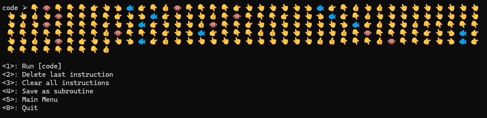
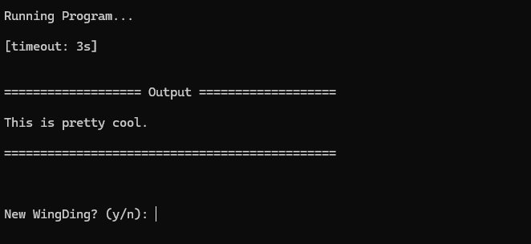

# WingDingFork
A BrainFuck interpreter but it's WingDings

### Running:
```
.\app\dingfork.exe
```

### Usage:

#### Enter or paste your [code] from the following (default) instructions, or modify the mapping file with different WingDings.
* [config](./dingfork/data/config.yml): configuration setttings
```
  dataConfigName : name of the keymap and subroutine directory in data
```
* [keymap](./dingfork/data/default/keymap): maps keyboard keys to WingDing symbols and instructions
   * Additional instruction for resetting memory [cls_tape]
```
INSTRUCTIONS:
   
   inc_data : Increment the data pointer by one (to point to the next cell to the right).
   dec_data : Decrement the data pointer by one (to point to the next cell to the left).
   inc_byte : Increment the byte at the data pointer by one.
   dec_byte : Decrement the byte at the data pointer by one.
   out_byte : Output the byte at the data pointer.
   inp_byte : Accept one byte of input, storing its value in the byte at the data pointer.
   loop_bgn : If the byte at the data pointer is zero, then instead of moving the instruction pointer forward to the next command, jump it forward to the command after the matching ] command.
   loop_end : If the byte at the data pointer is nonzero, then instead of moving the instruction pointer forward to the next command, jump it back to the command after the matching [ command.[a]
   cls_tape : Resets memory (tape) to zeroed state.

```

* You may create or save "subroutines", just make sure to add the name of the subroutine (ex: 🕿) to keymap.csv`
   - This is currently buggy when combining subroutines


### Example Program:







### Resources
```
Emoji List
https://en.wikipedia.org/wiki/List_of_emojis

Brainfuck
https://en.wikipedia.org/wiki/Brainfuck
```
### TODO
#### Features
- [ ] Convert text to WingDings, including subroutines
  - Text(file) -> BrainFuck -> WingDings -> SubWingDings
- [ ] Dynamic menus
- [ ] Dynamic unit tests
#### Bugs
- [ ] Fix user entered wingdings not being rendered
 - Saving subroutines, or other user entered WingDings that don't go through the filesystem
 - Reading wingdings from files or hardcoded seems to work 

