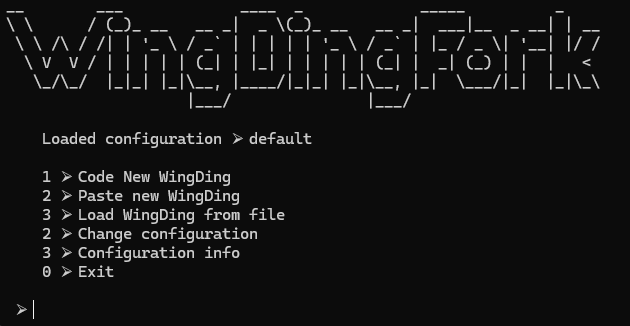

# WingDingFork
A BrainFuck interpreter but it's WingDings

### Running:
```
.\app\dingfork.exe
```

### Usage:

#### Enter or paste your [code] from the following (default) instructions, or modify the mapping file with different WingDings.
[WingDing <> key mapping](./dingfork/data/keymap.csv)

* Keys must include the brainfuck instruction set: [],.+-<>
* You may create or save "subroutines", just make sure to add the name of the subroutine (ex: 🕿) to keymap.csv`
   - This is currently buggy when combining subroutines
```

### Example Program:



