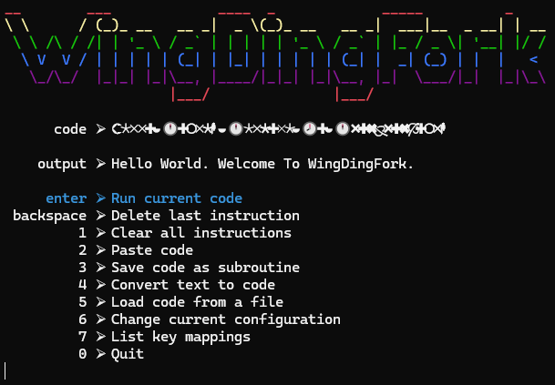

# WingDingFork
A [BrainF*ck](https://en.wikipedia.org/wiki/Brainfuck) interpreter, but it's [WingDings](https://en.wikipedia.org/wiki/Wingdings)
* Converts BrainF*ck code from the clipboard, files, or user input to runnable unicode instructions and subroutines.

## Running:
```
.\app\dingfork.exe
```
### Configuration:
* [config](./dingfork/data/config.yml): configuration setttings
```
  dataConfigName : name of the keymap and subroutine directory in data
```
* [subroutines/](./dingfork/data/default/subroutines/) are lists of instructions saved in the configured data folder
  * The name of each subroutine file corresponds with the instruction name in [keymap](./dingfork/data/default/keymap)
    * The line "`🐻|b^buffalo_bill`" maps the key wingding "`🐻`" to the keyboard shortbut "`b`" and the subroutine instruction "`buffalo_bill`"
* [keymap](./dingfork/data/default/keymap): maps keyboard keys to WingDing symbols and instructions.
   * Includes `subroutine` key mappings as [wingding|key^subroutine_name] 
   * Additional instruction for resetting memory [`cls_tape`]
```
#### Base Instruction Set:
   
   inc_data : Increment the data pointer by one (to point to the next cell to the right).
   dec_data : Decrement the data pointer by one (to point to the next cell to the left).
   inc_byte : Increment the byte at the data pointer by one.
   dec_byte : Decrement the byte at the data pointer by one.
   out_byte : Output the byte at the data pointer.
   inp_byte : Accept one byte of input, storing its value in the byte at the data pointer.
   loop_bgn : If the byte at the data pointer is zero, then instead of moving the instruction pointer forward to the next command, jump it forward to the command after the matching ] command.
   loop_end : If the byte at the data pointer is nonzero, then instead of moving the instruction pointer forward to the next command, jump it back to the command after the matching [ command.[a]
   cls_tape : Resets memory (tape) to zeroed state.

```

### Screenshots

#### Main Menu



#### Hello World


#### Generating BrainF*ck instructions from text and saving as a subroutine


#### Saving nested subroutines


#### Listing instructions from different configurations

##### Default


##### Alpha


